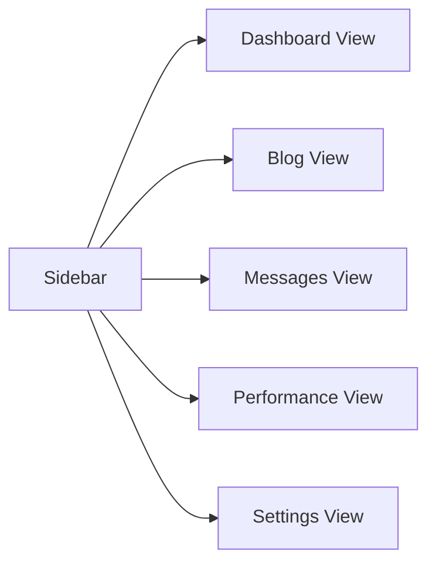
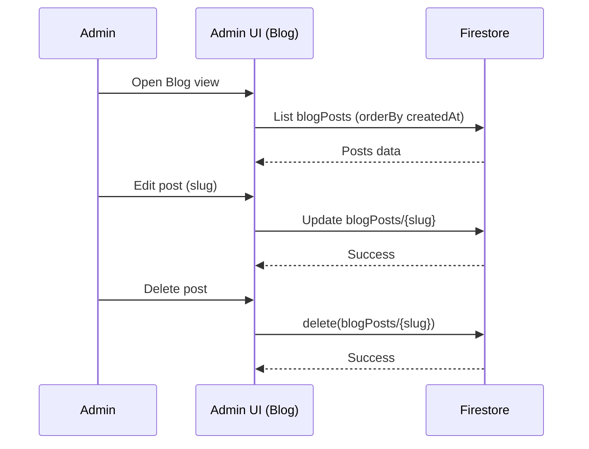

# Admin Dashboard

The admin dashboard provides a premium, professional interface for managing site content.

## Layout & Navigation

- Sidebar options:
  - Dashboard
  - Blog
  - Messages
  - Performance
  - Settings
- Top bar with mobile trigger and brand.
- Content area renders the active view.

## Views

- Dashboard: KPIs for posts, messages, and visits.
- Blog: List, edit, delete posts; AI-powered creation.
- Messages: Contact form submissions with actions.
- Performance: Placeholder for analytics and uptime (extensible).
- Settings: Placeholder for admin preferences and site config.

## Blog Editing UX

> [!NOTE]
> AI creation flow is documented in `docs/architecture.md` under the Admin Dashboard Sequence.

## Authentication

- Routes under `src/app/(admin)` are gated by Firebase Authentication.
- Unauthenticated users are redirected to `/admin/login`.

## File References

- `src/app/(admin)/admin/(dashboard)/layout.tsx` — Admin shell + sidebar.
- `src/app/(admin)/admin/page.tsx` — Root page; handles view switching.
- `src/types/blog.ts` — Blog type definitions.
- `src/firebase/client.ts` — Firebase client initialization.
