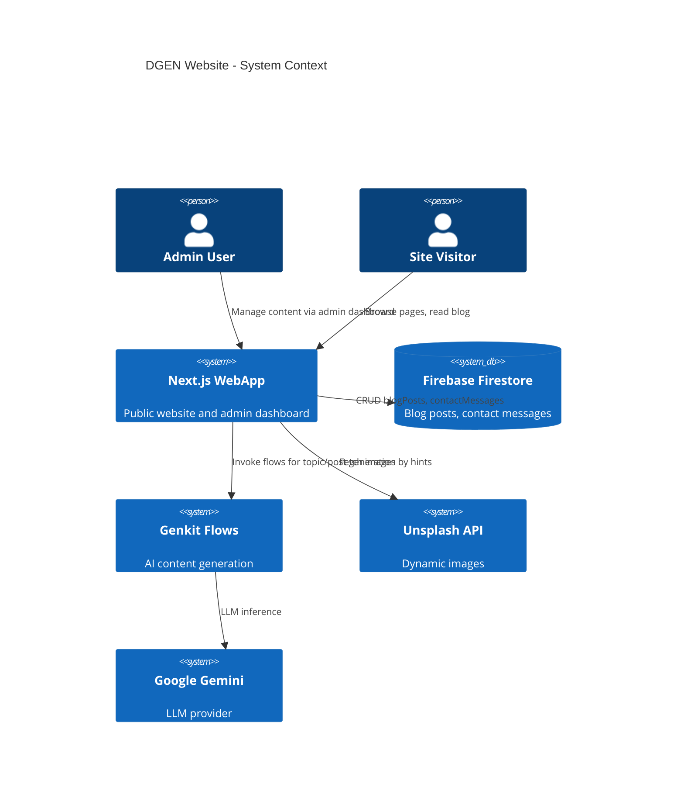
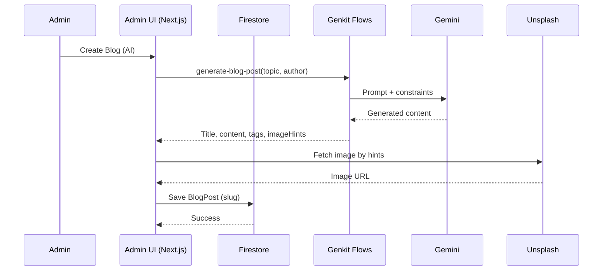
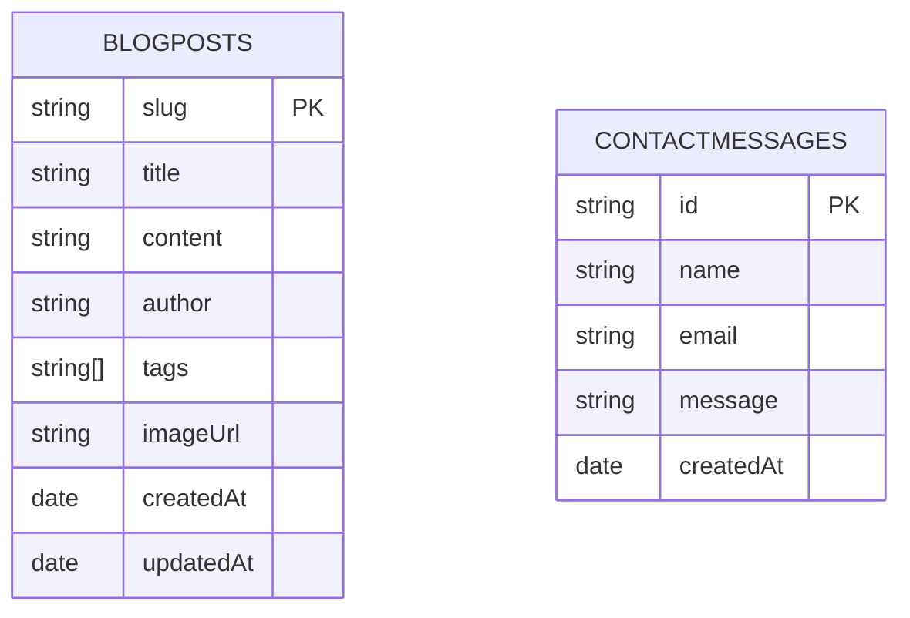

# Architecture

## System Overview

## Admin Dashboard Sequence

## Data Model (ERD)

## Code Layout

- `src/app` — Public pages and app router
- `src/app/(admin)` — Admin dashboard routes and layout
- `src/components/ui` — ShadCN-based UI components
- `src/ai/flows` — Genkit flows for AI operations
- `firebase/` — Client/server Firebase setups
